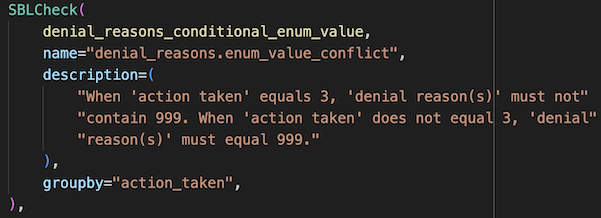

# RegTech Data Validator

This is a RegTech submission data parser and validator which makes use of Pandera. You can read about Pandera schemas [here](https://pandera.readthedocs.io/en/stable/dataframe_schemas.html).

## Dev Container Setup

The code in this repository is developed and run inside of a dev container within Visual Studio Code. These instructions will not work if using an alternative editor such as Vim or Emacs. To build, run, and attach the container to VS Code you'll need to have Docker installed on your system, and the `Dev Containers` extension installed within VS Code.

Open this repository within VS Code and press `COMMAND + SHIFT + p` on your keyboard. This will open the command bar at the top of your window. Enter `Dev Containers: Rebuild and Reopen in Container`. VS Code will open a new window and you'll see a status message towards the bottom right of your screen that the container is building and attaching. This will take a few minutes the first time because Docker needs to build the container without a build cache. You may receive a notification that VS Code wants to perform a reload because some extensions could not load. Sometimes this happens because extensions are loaded in conflicting orders and dependencies are not satisfied.

## Running the Demo

If using VS Code, setup is completed by simply running the code within a Dev Container. If you're not making use of VS Code, make your life easier and use VS Code :sunglasses:. See the instructions above for setting up the Dev Container.

There are few files in `src/validator` that will be of interest. 
- `checks.py` defines custom Pandera Check class called `SBLCheck`. 
- `global_data.py` defines functions to parse NAICS and GEOIDs.
- `phase_validations.py` defines phase 1 and phase 2 Pandera schema/checks used for validating the SBLAR data.
- `check_functions.py` contains a collection of functions to be run against the data that are a bit too complex to be implemented directly within the schema as Lambda functions.
- Lastly, the file `main.py` pulls everything together and illustrates how the schema can catch the various validation errors present in our mock, invalid dataset and different LEI values.

## Test data
- The repo includes tests that can be executed using `pytest`.  These tests can be located under `src/tests`.
- The repo also includes 2 test datasets for manual testing, one with all valid data, and one where each line
represents a different failed validation, or different permutation of of the same
failed validation.

- [`sbl-validations-pass.csv`](src/tests/data/sbl-validations-pass.csv)
- [`sbl-validations-fail.csv`](src/tests/data/sbl-validations-fail.csv)

### Manual Test
```sh
# Test validating the "good" file
# If passing lei value, pass lei as first arg and csv_path as second arg
python src/validator/main.py 000TESTFIUIDDONOTUSE src/tests/data/sbl-validations-pass.csv
# else just pass the csv_path as arg
python src/validator/main.py src/tests/data/sbl-validations-pass.csv

# Test validating the "bad" file
python src/validator/main.py 000TESTFIUIDDONOTUSE src/tests/data/sbl-validations-fail.csv
# or
python src/validator/main.py src/tests/data/sbl-validations-fail.csv
```


## Development

Development Process
Below are the steps the development team follows to fix issues, develop new features, etc.

1. Work in a branch
2. Create a PR to merge into main
3. The PR is automatically built, tested, and linted using: Travis, Snyk, and CodeCov
4. Manual review is performed in addition to ensuring the above automatic scans are positive
5. The PR is deployed to development servers to be checked
6. The PR is merged only by a separate member in the dev team

Development standard practice
* Check functions should focus on reuse.
  * Most of the validations share logic with other validations.
* Avoid using lambdas for Check functions.
  * They do not promote reuse.
  * They are harder to debug.
  * They are harder to test.
* Check function signatures should reflect the functionality.
* Check functions should have corresponding unit tests.
  * [Unit Test](./src/tests/test_check_functions.py)
* Check definitions' name should be set to validation ID.
  * Example: "denial_reasons. enum_value_conflict"
    

## Coverage
[](https://github.com/cfpb/regtech-data-validator/tree/python-coverage-comment-action-data)

## Contributing
[CFPB](https://www.consumerfinance.gov/) is developing the `RegTech Data Validator` in the open to maximize transparency and encourage third party contributions. If you want to contribute, please read and abide by the terms of the [License](./LICENSE) for this project. Pull Requests are always welcome.

## Open source licensing info
1. [TERMS](./TERMS.md)
1. [LICENSE](./LICENSE)
1. [CFPB Source Code Policy](https://github.com/cfpb/source-code-policy/)
