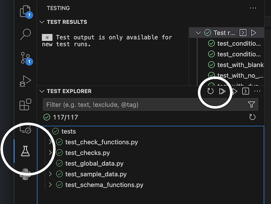

# RegTech Data Validator

[](https://github.com/cfpb/regtech-data-validator/tree/python-coverage-comment-action-data)

Python-based tool for parsing and validating CFPB's RegTech-related data submissions.
It uses [Pandera](https://pandera.readthedocs.io/en/stable/), a 
[Pandas](http://pandas.pydata.org/docs/getting_started/)-based data testing framework,
to define schemas for datasets and to perform all data validations. It is intended to
be used as a library for Python-based apps, but can also be used directly via
command-line interface.

We are currently focused on implementing the SBL (Small Business Lending) data
submission. For details on this dataset and its validations, please see:
[Filing instructions guide for small business lending data collected in 2024](https://www.consumerfinance.gov/data-research/small-business-lending/filing-instructions-guide/2024-guide/)

## Setup

The following setup must be completed prior to running the CLI utilities or doing any
development on the project.

### Prerequisites

The following software packages are prerequisites to installing this software.

- [Python](https://www.python.org/downloads/) version 3.11 or greater.
- [Poetry](https://python-poetry.org/docs/#installation) for Python package management.

### Install

1. Checkout this project

    ```sh
    git clone https://github.com/cfpb/regtech-data-validator.git
    cd regtech-data-validator
    ```

1. Install Python packages via Poetry

    ```sh
    poetry install
    ```

1. Activate Poetry's virtual environment

    ```sh
    poetry shell
    ```

**Note:** All Python packages used in project can be found in
[`pyproject.toml`](https://github.com/cfpb/regtech-data-validator/blob/main/pyproject.toml)

## Usage

This project includes the `cfpb-val` CLI utility for validating CFPB's RegTech-related
data collection file formats. It currently supports the small business lending (SBL) data
collected for 2024, but may support more formats in the future. This tool is intended for
testing purposes, allowing a quick way to check the validity of a file without having
to submit it through the full filing systems.

### Validating data

```
$ cfpb-val validate --help
                                                                                                       
 Usage: cfpb-val validate [OPTIONS] PATH                                                               
                                                                                                       
╭─ Arguments ─────────────────────────────────────────────────────────────────────────────────────────╮
│ *    path      FILE  [default: None] [required]                                                     │
╰─────────────────────────────────────────────────────────────────────────────────────────────────────╯
╭─ Options ───────────────────────────────────────────────────────────────────────────────────────────╮
│ --context        <key>=<value>            [example: lei=12345678901234567890]                       │
│ --output         [csv|json|pandas|table|download]                                                   │   
│                                           [default: table]                                          │
│ --help                                    Show this message and exit.                               │
╰─────────────────────────────────────────────────────────────────────────────────────────────────────╯
```

#### Examples

1. Validate a file with no findings

        $ cfpb-val validate tests/data/sbl-validations-pass.csv
        status: SUCCESS, findings: 0

1. Validate a file with findings, passing in LEI as context

        $ cfpb-val validate tests/data/sbl-validations-fail.csv --context lei=000TESTFIUIDDONOTUSE

        ╭────────────┬───────────┬──────────────────┬────────────────────────────────────────────────────┬─────────────────────┬───────────────┬──────────────────────────────────────╮
        │ finding_no │ record_no │ field_name       │ field_value                                        │ validation_severity │ validation_id │ validation_name                      │
        ├────────────┼───────────┼──────────────────┼────────────────────────────────────────────────────┼─────────────────────┼───────────────┼──────────────────────────────────────┤
        │          1 │         4 │ uid              │ 000TESTFIUIDDONOTUSEXBXVID13XTC1                   │ error               │ E3000         │ uid.duplicates_in_dataset            │
        │          2 │         5 │ uid              │ 000TESTFIUIDDONOTUSEXBXVID13XTC1                   │ error               │ E3000         │ uid.duplicates_in_dataset            │
        │          3 │         0 │ uid              │                                                    │ error               │ E0001         │ uid.invalid_text_length              │
        │          4 │         1 │ uid              │ BXUIDXVID11XTC2                                    │ error               │ E0001         │ uid.invalid_text_length              │
        │          5 │         2 │ uid              │ BXUIDXVID11XTC31234567890123456789012345678901     │ error               │ E0001         │ uid.invalid_text_length              │
        │        ... │       ... │ ...              │ ...                                                │ ...                 │ ...           │ ...                                  │
        │        115 │       278 │ po_4_race_baa_ff │ 12345678901234567890123456789012345678901234567890 │ error               │ E1000         │ po_4_race_baa_ff.invalid_text_length │
        │        116 │       290 │ po_4_race_pi_ff  │ 12345678901234567890123456789012345678901234567890 │ error               │ E1020         │ po_4_race_pi_ff.invalid_text_length  │
        │        117 │       302 │ po_4_gender_flag │ 9001                                               │ error               │ E1040         │ po_4_gender_flag.invalid_enum_value  │
        │        118 │       306 │ po_4_gender_ff   │ 12345678901234567890123456789012345678901234567890 │ error               │ E1060         │ po_4_gender_ff.invalid_text_length   │
        ╰────────────┴───────────┴──────────────────┴────────────────────────────────────────────────────┴─────────────────────┴───────────────┴──────────────────────────────────────╯
        status: FAILURE, findings: 118, validation phase: Syntactical

1. Validate a file with findings with output in JSON format

        $ cfpb-val validate tests/data/sbl-validations-fail.csv --output json

        [
            {
                "validation": {
                    "id": "E0001",
                    "name": "uid.invalid_text_length",
                    "description": "'Unique identifier' must be at least 21 characters in length and at most 45 characters in length.",
                    "severity": "error"
                },
                "records": [
                    {
                        "record_no": 0,
                        "fields": [
                            {
                                "name": "uid",
                                "value": ""
                            }
                        ]
                    },
                    {
                        "record_no": 1,
                        "fields": [
                            {
                                "name": "uid",
                                "value": "BXUIDXVID11XTC2"
                            }
                        ]
                    },
                    {
                        "record_no": 2,
                        "fields": [
                            {
                                "name": "uid",
                                "value": "BXUIDXVID11XTC31234567890123456789012345678901"
                            }
                        ]
                    }
                ]
            },
            ...
        status: FAILURE, findings: 118

## Test Data

This repo includes 2 test datasets, one with all valid data, and one where each
line represents a different failed validation, or different permutation of the same
failed validation.

- [`sbl-validations-pass.csv`](tests/data/sbl-validations-pass.csv)
- [`sbl-validations-fail.csv`](tests/data/sbl-validations-fail.csv)

We use these test files in for automated test, but can also be passed in via the
`cfpb-val` CLI utility for manual testing.

## Development

This section is for developer who wish to contribute to this project.

**Note:** If you simply want to use the **cfpb-val** tool for testing you data,
you don't need to read any further.

### Best practices

#### `Check` functions

- Check functions should focus on reuse.
    - Most of the validations share logic with other validations.
- Avoid using lambdas for Check functions.
    - They do not promote reuse.
    - They are harder to debug.
    - They are harder to test.
- Check function signatures should reflect the functionality.
- Check functions should have corresponding unit tests.
    - [Unit Test](tests/test_check_functions.py)
- Check definitions' name should be set to validation ID.
    - Example: "denial_reasons. enum_value_conflict"
      
- Check new added lines are formatted correctly.


## Testing

This project uses [pytest](https://docs.pytest.org/) for automated testing.

### Running tests

```
$ pytest
======================================================= test session starts =======================================================
platform darwin -- Python 3.12.0, pytest-7.4.0, pluggy-1.3.0 -- /Users/keelerh/Library/Caches/pypoetry/virtualenvs/regtech-data-validator-p5DmiWB0-py3.12/bin/python
cachedir: .pytest_cache
rootdir: /Users/keelerh/Projects/regtech-data-validator
configfile: pyproject.toml
testpaths: tests
plugins: cov-4.1.0, typeguard-4.1.3
collected 112 items                                                                                                               

tests/test_check_functions.py::TestInvalidDateFormat::test_with_valid_date PASSED                                           [  0%]
tests/test_check_functions.py::TestInvalidDateFormat::test_with_invalid_date PASSED                                         [  1%]
tests/test_check_functions.py::TestInvalidDateFormat::test_with_invalid_day PASSED                                          [  2%]
tests/test_check_functions.py::TestInvalidDateFormat::test_with_invalid_month PASSED                                        [  3%]
tests/test_check_functions.py::TestInvalidDateFormat::test_with_invalid_year PASSED                                         [  4%]
...
tests/test_schema_functions.py::TestValidatePhases::test_with_valid_lei PASSED                                              [ 96%]
tests/test_schema_functions.py::TestValidatePhases::test_with_invalid_data PASSED                                           [ 97%]
tests/test_schema_functions.py::TestValidatePhases::test_with_multi_invalid_data_with_phase1 PASSED                         [ 98%]
tests/test_schema_functions.py::TestValidatePhases::test_with_multi_invalid_data_with_phase2 PASSED                         [ 99%]
tests/test_schema_functions.py::TestValidatePhases::test_with_invalid_lei PASSED                                            [100%]


---------- coverage: platform darwin, python 3.12.0-final-0 ----------
Name                                          Stmts   Miss Branch BrPart  Cover   Missing
-----------------------------------------------------------------------------------------
regtech_data_validator/check_functions.py       184     14     78      0    91%   55-59, 111-121, 275-276, 297-298, 420-421
regtech_data_validator/checks.py                 15      0      2      0   100%
regtech_data_validator/cli.py                    62     62     30      0     0%   1-126
regtech_data_validator/create_schemas.py         61      3     18      3    92%   94, 99, 133
regtech_data_validator/global_data.py            12      0      8      0   100%
regtech_data_validator/phase_validations.py       6      0      0      0   100%
regtech_data_validator/schema_template.py         6      0      0      0   100%
-----------------------------------------------------------------------------------------
TOTAL                                           346     79    136      3    75%

3 empty files skipped.
Coverage XML written to file coverage.xml
```


### Test Coverage

Test coverage details can be found in this project's
[`python-coverage-comment-action-data`](https://github.com/cfpb/regtech-data-validator/tree/python-coverage-comment-action-data)
branch.


### Checking validation code vs. validations CSV

The ([`test_csv_to_code_differences.py`](tests/test_csv_to_code_differences.py)) test compares the validation code in
[`phase_validations.py`](regtech_data_validator/phase_validations.py) against the CSV-based 2024 SBL validation spec
([`2024-validations.csv`](https://github.com/cfpb/sbl-content/blob/main/fig-files/validation-spec/2024-validations.csv)).
This test checks that the list of validation IDs in one match the other, and will report on IDs that are missing in either.
The test will also validate that all severities (error or warning) match.  The test will then
do a hard string compare between the validation descriptions, with a couple of caveats:
- Any python validation check whose description starts with a single quote will first add the single quote
  to the CSV's description, if one doesn't exist.  This is done because if someone modifies the CSV in Excel,
  Excel will drop the beginning single quote, which it interprets as a formatter telling Excel "this field is a string"
- Certain descriptions in the CSV have 'complex' formatting to produce layouts with lists, new lines and white space
  that may not compare correctly.  Since how validation descriptions will be formatted on the results page for a submission,
  currently the test will strip off some of this formatting and compare the text.

This test runs automatically as part of our unit testing pipeline.  You can also
run the test manually by running the command `poetry run pytest tests/test_csv_to_code_differences.py`

This will create an `errors.csv` file at the root of the repo that can be used to easily view 
differences found between the two files.

Normally the pytest will point to the main branch in the sbl-content repo, but you can modify the test to
point to a development branch that has upcoming changes, run the test with the above command,
and then evaluate what changes may need to be made to the python validation code.

## Linting

This repository utilizing `black` and `ruff` libraries to check and fix any
formatting issues.

```sh
# Example of Ruff with an error
$ ruff .                
tests/test_check_functions.py:205:26: E712 [*] Comparison to `False` should be `cond is False`
Found 1 error.
[*] 1 potentially fixable with the --fix option.

# Example of black with reformatted line
$ black .               
reformatted regtech_data_validator/cli.py

All done! ✨ 🍰 ✨
1 file reformatted, 13 files left unchanged.
```

## (Optional) Visual Studio Code (VS Code) with Dev Containers setup

This setup uses [VS Code's Dev Containers extension](https://code.visualstudio.com/docs/devcontainers/containers)
to create a standardized development environment, allowing for a quick setup, and a greater guarantee
that you'll have all the tools you need to start developing. It does rely heavily on
[Docker](https://docs.docker.com/), so some familiarity there is highly recommended.

### Prerequisites

- [Docker](https://docs.docker.com/desktop/)
- [Visual Studio Code](https://code.visualstudio.com/Download)
    - [Dev Containers extension](https://marketplace.visualstudio.com/items?itemName=ms-vscode-remote.remote-containers)

### Setup instructions

1. Open this repository within VS Code and press `COMMAND + SHIFT + p` on your
   keyboard. This will open the command bar at the top of your window.
1. Enter `Dev Containers: Rebuild and Reopen in Container`. VS Code will open a
   new window and you'll see a status message towards the bottom right of your
   screen that the container is building and attaching.
1. This will take a few minutes the first time because Docker needs to build the
   container without a build cache.
1. You may receive a notification that VS Code wants to perform a reload because
   some extensions could not load. Sometimes this happens because extensions are
   loaded in conflicting orders and dependencies are not satisfied.


### Running unit tests

Unit tests can be run through VS Code Test.




## Contributing

[CFPB](https://www.consumerfinance.gov/) is developing the
`RegTech Data Validator` in the open to maximize transparency and encourage
third party contributions. If you want to contribute, please read and abide by
the terms of the [License](./LICENSE) for this project. Pull Requests are always
welcome.

## Contact Us

If you have an inquiry or suggestion for the validator or any SBL related code
please reach out to us at <sblhelp@cfpb.gov>


## Open source licensing info

1. [TERMS](./TERMS.md)
1. [LICENSE](./LICENSE)
1. [CFPB Source Code Policy](https://github.com/cfpb/source-code-policy/)
